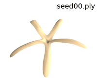
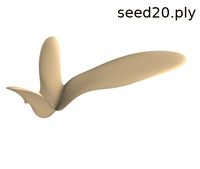
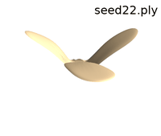
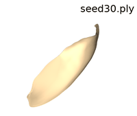
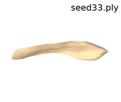
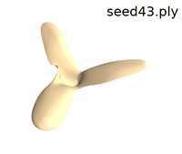
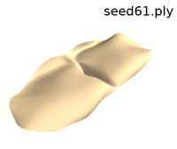
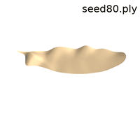
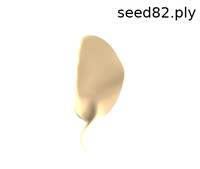
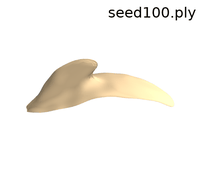

# Computational Biomimetics of Winged Seeds


This codebase contains the research code associated with the paper "[Computational Biomimetics of Winged Seeds
](https://leqiqin.github.io/publication/seeds2024)" (ACM Transactions on Graphics, SIGGRAPH Asia 2024).
## System requirement
We compiled and tested this codebase on the following system:
- Ubuntu 22.04;
- Python 3.10;
- CUDA 11.8
## Installation
```
conda env create -f environment.yaml
```

## Running Optimization Experiments
### Sec 9.1 Descent Experiment
```
python optimize_falling.py
```
### Sec 9.2 Rotational Acceleration Experiment
```
python optimize_rotation.py
```
### Sec 9.3 Expectation Comparison Experiment
```
python optimize_expectation.py
```
### Sec 9.4 Regression Experiment
```
python optimize_regression.py
```
### Sec 9.5 Fabrication Experiment
```
cd fabrication
python optimize_fabrication.py
```

## Visualization of the Shape Space
Shooting data of the seeds are included in the data/shooting directory. We provide a visualization program based on [Polyscope](https://polyscope.run/), which allows you to explore the shape space spanned by the seeds. To visualize the shape space, run
```
python shape_space.py
```
You can modify the interpolation parameters in the upper right corner. 
Note that the current visualization program only includes a subset of seeds; to include others, you can modify the shape_space.py file.

## Download Datasets
Download original scanned winged-seeds models [here](datasets/winged_seeds_models_scan.zip).

Download winged-seeds models recontructed by LDDMM shooting [here](datasets/winged_seeds_models_shoot.zip).

Each shooting mesh is denoted by "seed{a}{b}.ply", where {a} is an identifier for its species and {b} represents its sequential number within that species. 

### Species Identifier and Corresponding Scientific Name

| Identifier | Species                    |
|------------|----------------------------|
| 0          | Bluebird Vine              |
| 1          | Hopea hainanensis          |
| 2          | Engelhardia spicata        |
| 3          | Spinyleaf pricklyash       |
| 4          | Congea tomentosa           |
| 5          | Hiptage lucida             |
| 6          | Illigera rhodantha         |
| 7          | Securidaca inappendiculata |
| 8          | Tipuana tipu               |
| 9          | Loeseneriella yunnanensis  |
| 10         | Pterocymbium               |
| 11         | Pterygota alata            |
| 12         | Scaphium wallichii         |
| 13         | Ventilago leiocarpa        |

### Visualization of the Shooting Dataset











